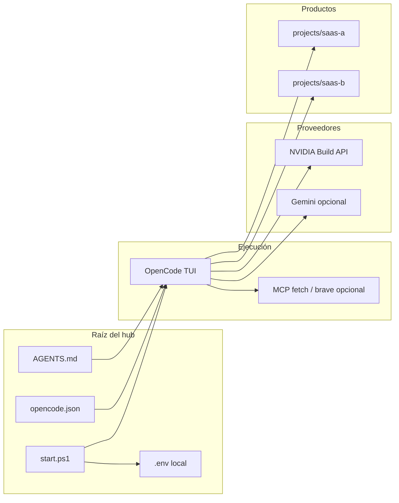

<p align="center">
  
</p>

<h1 align="center">OpenCode · NVIDIA Build Hub</h1>

<p align="center">
  <strong>Plantilla de workspace</strong> para desarrollo asistido con <a href="https://opencode.ai">OpenCode</a> sobre <a href="https://build.nvidia.com">NVIDIA Build</a> (API OpenAI-compatible), con rutas claras para múltiples productos en <code>projects/</code>.
</p>

<p align="center">
  <a href="./LICENSE"></a>
  <a href="https://opencode.ai/docs"></a>
  <a href="https://build.nvidia.com/explore/discover"></a>
  <a href="https://www.typescriptlang.org/"></a>
</p>

<p align="center">
  <a href="#visión">Visión</a> ·
  <a href="#arquitectura">Arquitectura</a> ·
  <a href="#capacidades">Capacidades</a> ·
  <a href="#inicio-en-3-pasos">Inicio</a> ·
  <a href="#configuración">Configuración</a> ·
  <a href="#operación-y-seguridad">Operación</a>
</p>

---

## Visión

Este repositorio no es una aplicación: es un **hub de configuración** pensado para equipos que quieren **una sola capa de orquestación** (reglas, modelos, MCP) separada del código de cada SaaS.

| Principio | Qué significa en la práctica |
|-------------|------------------------------|
| **Separación** | La raíz contiene solo OpenCode + scripts; cada producto vive en `projects/<nombre>/`. |
| **Portabilidad** | Clonar, copiar `.env.example` → `.env`, ejecutar `start.ps1` y trabajar. Sin secretos en git. |
| **Escala** | Añade providers en `opencode.json` y claves en `.env`; los proyectos bajo `projects/` pueden versionarse con su propio git. |

---

## Arquitectura



---

## Capacidades

<table>
<tr>
<td width="33%" valign="top">

### Modelos y routing

Providers NVIDIA (Mistral, Kimi, Qwen, GPT-OSS), Gemini opcional, cambio de modelo en caliente con `/models`. Matriz de uso documentada en [`AGENTS.md`](./AGENTS.md).

</td>
<td width="33%" valign="top">

### Automatización Windows

`start.ps1` valida claves, prepara entorno y lanza OpenCode. Modo `-Test` ejecuta smoke test contra la API NVIDIA vía Python.

</td>
<td width="33%" valign="top">

### Extensión controlada

Plantillas en [`config/providers.template.json`](./config/providers.template.json). Guía de altas en [`docs/add-model.md`](./docs/add-model.md). Scaffold de carpetas con [`scripts/new-project.ps1`](./scripts/new-project.ps1).

</td>
</tr>
</table>

---

## Inicio en 3 pasos

**1. Clonar y entorno**

```powershell
git clone https://github.com/DanielUsuario001/opencode-nvidia-build-hub.git
cd opencode-nvidia-build-hub
Copy-Item .env.example .env
```

**2. Claves NVIDIA Build** — con la configuración por defecto del repo basta **`NVIDIA_API_KEY_GPTOSS`** (modelo [gpt-oss-120b](https://build.nvidia.com) → *Get API Key*). Rellena el resto si vas a usar otros modelos en `/models`.

**3. Arrancar**

```powershell
Set-ExecutionPolicy -Scope CurrentUser RemoteSigned   # solo si PowerShell bloquea scripts
.\start.ps1 -Test    # opcional: verifica API
.\start.ps1
```

| En el TUI | Atajo |
|-----------|--------|
| Cambiar modelo | `/models` |
| Reglas del workspace | definidas en `AGENTS.md` (referenciado en `opencode.json`) |
| Documentación OpenCode | [opencode.ai/docs](https://opencode.ai/docs) |

---

## Configuración

### Variables de entorno

| Variable | Rol |
|----------|-----|
| `NVIDIA_API_KEY_GPTOSS` | Provider por defecto (`nvidia-gptoss/120b`). |
| `NVIDIA_API_KEY_MISTRAL` | Planificación y revisión (`nvidia-mistral/*`). |
| `NVIDIA_API_KEY_KIMI` | Tareas rápidas si configuras `small_model` en Kimi. |
| `NVIDIA_API_KEY_QWEN` | Modelo coder de alta capacidad. |
| `GOOGLE_GENERATIVE_AI_API_KEY` | Familia Gemini en `opencode.json`. |
| `BRAVE_API_KEY` | MCP Brave; activa `"enabled": true` bajo `mcp.brave-search` cuando tengas clave. |

El archivo **`.env` no se versiona** (`.gitignore`). Usa solo **`.env.example`** como referencia para el equipo.

### Estructura del repositorio

```
.
├── opencode.json              # Providers, modelo default, MCP, permisos
├── tui.json                   # Tema del TUI
├── AGENTS.md                  # Contrato de comportamiento del workspace
├── start.ps1                  # Entrada Windows
├── LICENSE                    # MIT — DanielUsuario001
├── assets/
│   └── readme-hero.png        # Identidad visual del README
├── config/providers.template.json
├── docs/add-model.md
├── scripts/
│   ├── new-project.ps1
│   ├── test_nvidia.py
│   └── requirements.txt
└── projects/                  # Productos (gitignore salvo README + .gitkeep)
```

---

## Operación y seguridad

| Tema | Recomendación |
|------|----------------|
| Secretos | Nunca subas `.env` ni `.env.local` de producto; rota claves si hubo fuga. |
| MCP Brave | Desactivado por defecto para clones sin clave. |
| Proyectos | `projects/*` ignorado en este repo: cada SaaS puede tener su propio remoto y CI. |

### Solución de problemas frecuentes

| Síntoma | Acción |
|---------|--------|
| Scripts no ejecutan | `Set-ExecutionPolicy -Scope CurrentUser RemoteSigned` |
| `no hay ninguna API key reconocible` | Claves NVIDIA: prefijo `nvapi-` y longitud válida; sin espacios extra. |
| `401` / `404` en modelo | Key incorrecta para ese endpoint o `id` de modelo distinto al de build.nvidia.com. |
| Sin Python | `.\start.ps1` funciona sin `-Test`; el test solo necesita Python + `scripts/requirements.txt`. |

---

## Licencia

MIT — ver [`LICENSE`](./LICENSE). Copyright DanielUsuario001.
